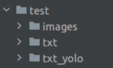

# Система классификации объектов

## Установка:

1. Клонируем репозиторий GIT:
```
    https://github.com/nosovdmitry007/jacet.git
```
2. Устанавливаем необхоимые библиотеки:
```
    pip install --upgrade pip
    cd jacket
    pip install -r requirements.txt
```
3. Необходимо загрузить [веса](https://disk.yandex.ru/d/Ch_yYr4kvGhgEg) моделей в папку `yolo5`
```
├── yolo5 
│   ├── about.txt
│   ├── chasha.pt
│   ├── jalet.pt
│   ├── yolov5m6.pt
```
## Пример:
1. Создаём экземпляр класса:
```
    from person import People, Kadr, Jalet, Chasha
    
    people = People()
    jalet = Jalet()
    chasha = Chasha()
    kad = Kadr()
```
### Детекция человека
2. Запускаем распознавание данных для 1-го файла:
```
    test = people.person_filter('path_to_image.jpg')
    print(test)
```
path_to_image.jpg - путь к файлу

На выходе получаем данные в pandas DF.

```
         xmin        ymin        xmax        ymax  confidence  class    name
0  705.028381   49.296021  735.822937  132.415070    0.494404      0  person
1  490.659943  163.209686  532.081177  254.662140    0.342938      0  person
3  663.615906  195.277115  698.396179  283.872375    0.259081      0  person
```

3. Запускаем распознавание данных для видео: 
```
    def person_filter_video(put):
        z = kad.cadre(put)
        df = pd.DataFrame()
        for i in tqdm(z, ncols=100):
            str = people.person_filter(i[0],i[1],'person',1)
            df = pd.concat([df, str])
        return df
```
Параметры people.person_filter:

```
i[0] - кадр 
i[1] - метка времени
filter - филтр каласса детекции
1 - индикатор видео
```
На выходе получаем данные в pandas DF.

```
           xmin         ymin         xmax         ymax  confidence class  \
0   1131.225098  1118.168457  1234.933105  1225.512573    0.737279     0   
0   1131.433105  1118.231323  1234.431519  1224.986450    0.727406     0   
0   1130.979248  1118.059326  1234.557129  1225.303589    0.731094     0   
0   1130.672974  1118.441040  1234.416260  1225.629272    0.728179     0   
0   1131.116333  1118.653931  1234.319214  1225.085693    0.717301     0   
..          ...          ...          ...          ...         ...   ...   
0   1124.108521  1125.171021  1233.567139  1228.800293    0.571940     0   
0   1123.753784  1125.221558  1233.893311  1228.533569    0.557397     0   
0   1123.530640  1124.986084  1233.745605  1228.137329    0.561760     0   
0   1123.635010  1124.851074  1234.006836  1228.033325    0.543853     0   
0   1123.701050  1125.873413  1234.172485  1227.449341    0.496264     0   

    name   time_cadr  
0   person  0:00:00.00  
0   person  0-00-00.13  
0   person  0-00-00.20  
0   person  0-00-00.33  
0   person  0-00-00.40  
..   ...         ...  
0   person  0-00-29.73  
0   person  0-00-29.80  
0   person  0-00-29.93  
0   person  0:00:30.00  
0   person  0-00-30.13 
```
### Детекция жилета


4. Запускаем распознавание данных для 1-го файла:
```
    test = jalet.jalet_filter('path_to_image.jpg')
    print(test)
```
path_to_image.jpg - путь к файлу

На выходе получаем данные в pandas DF.

```
         xmin        ymin        xmax        ymax  confidence  class    name
0  705.028381   49.296021  735.822937  132.415070    0.494404      0  person
1  490.659943  163.209686  532.081177  254.662140    0.342938      0  person
3  663.615906  195.277115  698.396179  283.872375    0.259081      0  person
```

5. Запускаем распознавание данных для видео:
```
    def jalet_filter_video(put):
        z = kad.cadre(put)
        df = pd.DataFrame()
        for i in tqdm(z, ncols=100):
            str = jalet.jalet_filter(i[0],i[1],1)
            df = pd.concat([df, str])
        return df
```
Параметры people.person_filter:

```
i[0] - кадр 
i[1] - метка времени
1 - индикатор видео
```
На выходе получаем данные в pandas DF.

```
           xmin         ymin         xmax         ymax  confidence class  \
0   1131.225098  1118.168457  1234.933105  1225.512573    0.737279     0   
0   1131.433105  1118.231323  1234.431519  1224.986450    0.727406     0   
0   1130.979248  1118.059326  1234.557129  1225.303589    0.731094     0   
0   1130.672974  1118.441040  1234.416260  1225.629272    0.728179     0   
0   1131.116333  1118.653931  1234.319214  1225.085693    0.717301     0   
..          ...          ...          ...          ...         ...   ...   
0   1124.108521  1125.171021  1233.567139  1228.800293    0.571940     0   
0   1123.753784  1125.221558  1233.893311  1228.533569    0.557397     0   
0   1123.530640  1124.986084  1233.745605  1228.137329    0.561760     0   
0   1123.635010  1124.851074  1234.006836  1228.033325    0.543853     0   
0   1123.701050  1125.873413  1234.172485  1227.449341    0.496264     0   

    name   time_cadr  
0   jalet  0:00:00.00  
0   jalet  0-00-00.13  
0   jalet  0-00-00.20  
0   no_jalet  0-00-00.33  
0   jalet  0-00-00.40  
..   ...         ...  
0   jalet  0-00-29.73  
0   jalet  0-00-29.80  
0   jalet  0-00-29.93  
0   jalet  0:00:30.00  
0   jalet  0-00-30.13 
```
### Детекция чаши


4. Запускаем распознавание данных для 1-го файла:
```
    test = chasha.chasha_filter('path_to_image.jpg')
    print(test)
```
path_to_image.jpg - путь к файлу

На выходе получаем данные в pandas DF.

```
         xmin        ymin        xmax        ymax  confidence  class    name
0  705.028381   49.296021  735.822937  132.415070    0.494404      0  person
1  490.659943  163.209686  532.081177  254.662140    0.342938      0  person
3  663.615906  195.277115  698.396179  283.872375    0.259081      0  person
```

5. Запускаем распознавание данных для видео:
```
    def chasha_filter_video(put):
        z = kad.cadre(put)
        df = pd.DataFrame()
        for i in tqdm(z, ncols=100):
            str = chasha.chasha_filter(i[0],i[1],1)
            df = pd.concat([df, str])
        return df
```
Параметры people.person_filter:

```
i[0] - кадр 
i[1] - метка времени
1 - индикатор видео
```
На выходе получаем данные в pandas DF.

```
           xmin         ymin         xmax         ymax  confidence class  \
0   1131.225098  1118.168457  1234.933105  1225.512573    0.737279     0   
0   1131.433105  1118.231323  1234.431519  1224.986450    0.727406     0   
0   1130.979248  1118.059326  1234.557129  1225.303589    0.731094     0   
0   1130.672974  1118.441040  1234.416260  1225.629272    0.728179     0   
0   1131.116333  1118.653931  1234.319214  1225.085693    0.717301     0   
..          ...          ...          ...          ...         ...   ...   
0   1124.108521  1125.171021  1233.567139  1228.800293    0.571940     0   
0   1123.753784  1125.221558  1233.893311  1228.533569    0.557397     0   
0   1123.530640  1124.986084  1233.745605  1228.137329    0.561760     0   
0   1123.635010  1124.851074  1234.006836  1228.033325    0.543853     0   
0   1123.701050  1125.873413  1234.172485  1227.449341    0.496264     0   

    name   time_cadr  
0   bowl  0:00:00.00  
0   bowl  0-00-00.13  
0   bowl  0-00-00.20  
0   bowl  0-00-00.33  
0   bowl  0-00-00.40  
..   ...         ...  
0   bowl  0-00-29.73  
0   bowl  0-00-29.80  
0   bowl  0-00-29.93  
0   bowl  0:00:30.00  
0   bowl  0-00-30.13 
```

# Сохранение кадров и боксов

Для сохранения кадров и координат боксов в цикл вставляем код

```
        if len(str.name.unique()) != 0:
            sav(i[0], i[1], str,'test')
```
Пример:
```
def person_filter_video(put):
    z = kad.cadre(put)
    df = pd.DataFrame()
    for i in tqdm(z, ncols=100):
        str = people.person_filter(i[0],i[1],'person',1)
        df = pd.concat([df, str])
        if len(str.name.unique()) != 0:
            sav(i[0], i[1], str,'test')
    return df
```
i[0] - кадр 

i[1] - метка времени

str - датафрейм с координатами найденных классов

'test' - папка куда сохраняются кадрв и *.txt файлы с координатами

Структура каталога:



images - каталог с изображениями
txt - каталог с координатами в пиксельном формате
txt_yolo - аталог с координатами в формате YOLO